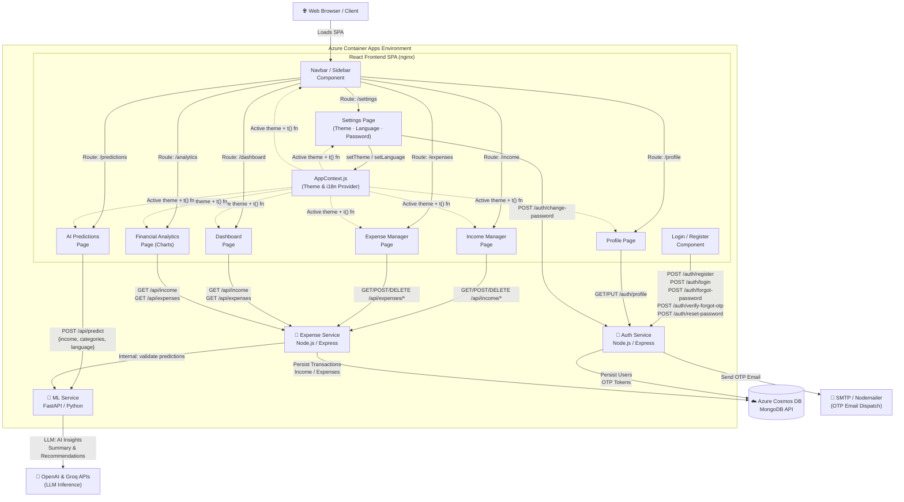

# Smart Financial Intelligence System
## A Cloud-Native Distributed Financial Intelligence Platform
A premium, production-grade microservices application that provides AI-powered financial insights, automated budgeting, and intelligent credit-score predictions. Built with a distributed cloud-native architecture, this system is containerized with Docker and ready for scalable deployment to **Azure Container Apps**.

---

## 🏗️ Architecture & System Design

The application is structured as a collection of loose-coupled microservices, each running in its own container and communicating over HTTPS.



### Microservice Breakdown:
1.  **Frontend (`/frontend`)**: A React single-page application optimized using a multi-stage Docker build and served via an **Nginx** server, complete with SPA route fallbacks.
2.  **Auth Service (`/auth-service`)**: Node.js & Express service handling authentication, JWT tokens, secure profile modifications, and OTP email dispatch via Nodemailer.
3.  **Expense Service (`/expense-service`)**: Node.js & Express service that manages user budgets, transactions, categories, and internal prediction handoffs.
4.  **ML Service (`/ml-service`)**: FastAPI & Python application executing AI models, expense forecasting, overspending analysis, and credit score calculations using Groq & OpenAI APIs.

---

## 🛠️ Tech Stack & DevOps Gems

*   **Frontend**: React (v19), Tailwind CSS, Recharts (for dashboard analytics)
*   **Backend**: Node.js, Express, FastAPI, Python
*   **Databases**: Azure Cosmos DB (MongoDB API)
*   **Containerization**: Docker, Docker Compose (multi-stage builds, non-root execution, `.dockerignore` optimized)
*   **Infrastructure as Code (IaC)**: Azure Bicep
*   **CI/CD Pipeline**: GitHub Actions
*   **Cloud Hosting**: Azure Container Apps (ACA), Azure Container Registry (ACR), Azure Log Analytics

---

## 🚀 Local Development Setup

To run the entire ecosystem locally in seconds:

1.  **Ensure Docker is installed and running.**
2.  **Configure environment files** (`.env`) in `/auth-service`, `/expense-service`, and `/ml-service`. (Use the variables outlined in the `.env.example` file if provided).
3.  **Launch the orchestration**:
    ```bash
    docker-compose up --build
    ```
4.  **Access the application**:
    *   Frontend UI: [http://localhost](http://localhost) (Port 80)
    *   Auth Service API: [http://localhost:5001](http://localhost:5001)
    *   Expense Service API: [http://localhost:5002](http://localhost:5002)
    *   ML Service API: [http://localhost:5003](http://localhost:5003)

---

## ☁️ Production Azure Deployment

The deployment pipeline is fully automated using **Infrastructure as Code (Bicep)** and **GitHub Actions**.

### Step 1: Initialize Infrastructure
To spin up all Azure resources (Container Apps, Registry, Log Analytics, environment, and secure parameters):
1.  Open PowerShell.
2.  Navigate to `/infra` and execute the deployment helper script:
    ```powershell
    ./deploy.ps1
    ```
    *This script will verify your Azure login, read your local secret configurations, create a Resource Group, and deploy the Bicep template securely.*

### Step 2: Set up GitHub Actions CI/CD
1.  Create a **Service Principal** in Azure using your terminal:
    ```bash
    az ad sp create-for-rbac --name "fin-intel-sp" --role contributor --scopes /subscriptions/<subscription-id>/resourceGroups/financial-intelligence-rg --sdk-auth
    ```
2.  Copy the JSON output from the command.
3.  Go to your GitHub repository -> **Settings** -> **Secrets and variables** -> **Actions** -> **New repository secret**.
4.  Add a secret named `AZURE_CREDENTIALS` and paste the JSON output.

### Step 3: Trigger the Pipeline
Whenever you push to the `main` branch:
1.  GitHub Actions will log into Azure and ACR.
2.  Compile and push optimized production-grade Docker images.
3.  Dynamically inject the live Azure FQDN URLs into the frontend compile step.
4.  Perform zero-downtime rolling updates to all your Azure Container Apps.
