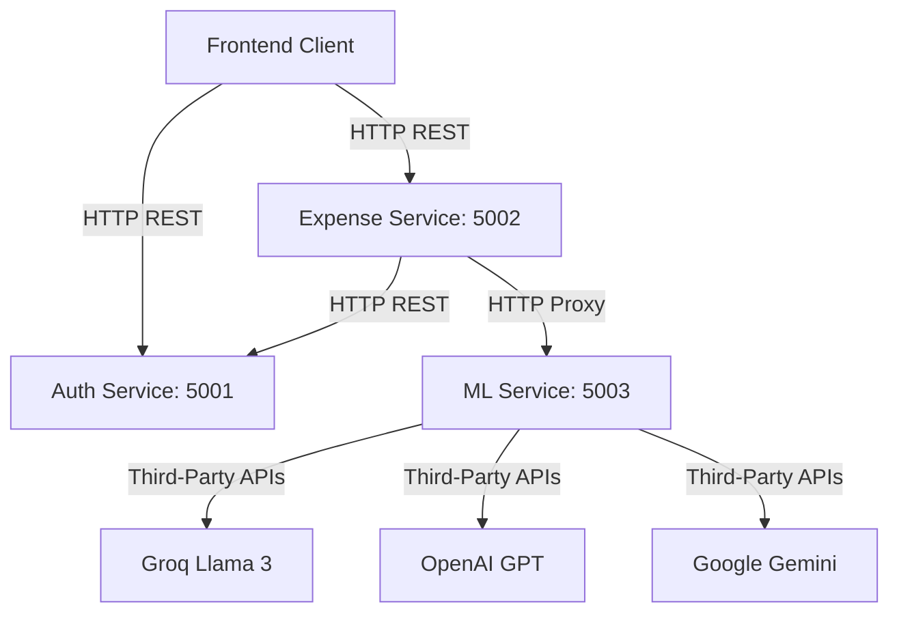

# 📡 API Contracts

This document contains the complete and official API Contracts for the Cloud-Based Distributed Financial Intelligence System. All microservices communicate using JSON REST APIs.

---

## 🔹 Overview & Service Environments

### 💻 Local Development (Localhost)
*   **Frontend Client:** `http://localhost:3000` (or `http://localhost` on Port 80 via Nginx Docker container)
*   **Auth Service:** `http://localhost:5001`
*   **Expense Service:** `http://localhost:5002`
*   **ML Service:** `http://localhost:5003`

### ☁️ Azure Container Apps (Production)
*   **Frontend Client:** `https://smart-financial-intelligence.wonderfulbeach-8c27da84.centralindia.azurecontainerapps.io`
*   **Auth Service:** `https://auth-service.wonderfulbeach-8c27da84.centralindia.azurecontainerapps.io`
*   **Expense Service:** `https://expense-service.wonderfulbeach-8c27da84.centralindia.azurecontainerapps.io`
*   **ML Service:** `https://ml-service.wonderfulbeach-8c27da84.centralindia.azurecontainerapps.io`

---

## 🔐 Auth Service (Port: 5001)

All endpoints below are prefixed with `/auth`.

### 1. `POST /auth/register`
Registers a new user in the system.

*   **Authentication:** None (Public)
*   **Request Body:**
    ```json
    {
      "username": "john_doe",
      "email": "john@example.com",
      "password": "securepassword123"
    }
    ```
*   **Response (200 OK):**
    ```json
    {
      "msg": "User registered successfully"
    }
    ```
*   **Response (400 Bad Request):**
    ```json
    {
      "msg": "User already exists"
    }
    ```

### 2. `POST /auth/login`
Authenticates a user and returns a JSON Web Token (JWT) valid for 1 day.

*   **Authentication:** None (Public)
*   **Request Body:**
    ```json
    {
      "email": "john@example.com",
      "password": "securepassword123"
    }
    ```
*   **Response (200 OK):**
    ```json
    {
      "token": "eyJhbGciOi...",
      "user": {
        "user_id": "651a2b3c4d5e6f7a8b9c0d1e",
        "username": "john_doe"
      }
    }
    ```
*   **Response (400 Bad Request):**
    ```json
    {
      "msg": "User not found"
    }
    ```
    *or*
    ```json
    {
      "msg": "Invalid password"
    }
    ```

### 3. `GET /auth/profile`
Retrieves profile details of the currently authenticated user.

*   **Authentication:** Required (`Authorization: Bearer <token>`)
*   **Response (200 OK):**
    ```json
    {
      "_id": "651a2b3c4d5e6f7a8b9c0d1e",
      "username": "john_doe",
      "email": "john@example.com",
      "phone": "9876543210"
    }
    ```

### 4. `PUT /auth/profile`
Updates the profile information of the currently authenticated user.

*   **Authentication:** Required (`Authorization: Bearer <token>`)
*   **Request Body:**
    ```json
    {
      "username": "john_doe_updated",
      "email": "john_updated@example.com",
      "phone": "1234567890"
    }
    ```
*   **Response (200 OK):**
    ```json
    {
      "_id": "651a2b3c4d5e6f7a8b9c0d1e",
      "username": "john_doe_updated",
      "email": "john_updated@example.com",
      "phone": "1234567890"
    }
    ```

### 5. `POST /auth/send-otp`
Sends an OTP verification email to an authenticated user (typically for validating a password change).

*   **Authentication:** Required (`Authorization: Bearer <token>`)
*   **Request Body:**
    ```json
    {
      "email": "john@example.com",
      "otp": "481516"
    }
    ```
*   **Response (200 OK):**
    ```json
    {
      "message": "Email sent!"
    }
    ```

### 6. `POST /auth/change-password`
Changes the user's password after verifying their current password.

*   **Authentication:** Required (`Authorization: Bearer <token>`)
*   **Request Body:**
    ```json
    {
      "currentPassword": "oldpassword123",
      "newPassword": "newpassword456"
    }
    ```
*   **Response (200 OK):**
    ```json
    {
      "msg": "Password changed successfully."
    }
    ```

### 7. `POST /auth/forgot-password`
Generates a 6-digit OTP code, saves the secure hash in the user profile, and sends it via email. Always returns a generic safe message to prevent user enumeration.

*   **Authentication:** None (Public)
*   **Request Body:**
    ```json
    {
      "email": "john@example.com"
    }
    ```
*   **Response (200 OK):**
    ```json
    {
      "msg": "If this email is registered, an OTP has been sent."
    }
    ```

### 8. `POST /auth/verify-forgot-otp`
Validates the reset OTP and issues a short-lived reset token (JWT, valid for 10 minutes).

*   **Authentication:** None (Public)
*   **Request Body:**
    ```json
    {
      "email": "john@example.com",
      "otp": "481516"
    }
    ```
*   **Response (200 OK):**
    ```json
    {
      "msg": "OTP verified successfully.",
      "resetToken": "eyJhbGciOi..."
    }
    ```

### 9. `POST /auth/reset-password`
Resets the password utilizing a valid `resetToken`. Invalidate the used OTP session so it cannot be reused.

*   **Authentication:** None (Public - uses `resetToken` in payload)
*   **Request Body:**
    ```json
    {
      "resetToken": "eyJhbGciOi...",
      "newPassword": "newsecurepassword123"
    }
    ```
*   **Response (200 OK):**
    ```json
    {
      "msg": "Password reset successful. You can now log in with your new password."
    }
    ```

---

## 💸 Expense Service (Port: 5002)

All endpoints below are prefixed with `/api`.

### 📂 Expense Management

#### 1. `POST /api/expenses/add`
Adds a new expense item. The backend automatically extracts and registers the month (e.g. `2026-06`) from the date.

*   **Authentication:** Required (`Authorization: Bearer <token>`)
*   **Request Body:**
    ```json
    {
      "amount": 1450.00,
      "category": "Food",
      "date": "2026-06-11"
    }
    ```
*   **Response (201 Created):**
    ```json
    {
      "_id": "651b3c4d5e6f7a8b9c0d1e2f",
      "user_id": "651a2b3c4d5e6f7a8b9c0d1e",
      "amount": 1450,
      "category": "Food",
      "date": "2026-06-11",
      "month": "2026-06"
    }
    ```

#### 2. `GET /api/expenses/:month`
Retrieves all expenses recorded by the user during the specified month (format: `YYYY-MM`).

*   **Authentication:** Required (`Authorization: Bearer <token>`)
*   **Response (200 OK):**
    ```json
    {
      "expenses": [
        {
          "_id": "651b3c4d5e6f7a8b9c0d1e2f",
          "user_id": "651a2b3c4d5e6f7a8b9c0d1e",
          "amount": 1450,
          "category": "Food",
          "date": "2026-06-11",
          "month": "2026-06"
        }
      ]
    }
    ```

#### 3. `PUT /api/expenses/:id`
Updates an existing expense entry.

*   **Authentication:** Required (`Authorization: Bearer <token>`)
*   **Request Body:**
    ```json
    {
      "amount": 1600.00,
      "category": "Food",
      "date": "2026-06-11"
    }
    ```
*   **Response (200 OK):**
    ```json
    {
      "_id": "651b3c4d5e6f7a8b9c0d1e2f",
      "user_id": "651a2b3c4d5e6f7a8b9c0d1e",
      "amount": 1600,
      "category": "Food",
      "date": "2026-06-11",
      "month": "2026-06"
    }
    ```

#### 4. `DELETE /api/expenses/:id`
Deletes a specific expense entry.

*   **Authentication:** Required (`Authorization: Bearer <token>`)
*   **Response (200 OK):**
    ```json
    {
      "msg": "Expense deleted"
    }
    ```

### 📂 Income Management

#### 1. `POST /api/income/add`
Records a new income entry.

*   **Authentication:** Required (`Authorization: Bearer <token>`)
*   **Request Body:**
    ```json
    {
      "amount": 65000.00,
      "source": "Salary",
      "date": "2026-06-01",
      "month": "2026-06"
    }
    ```
*   **Response (201 Created):**
    ```json
    {
      "_id": "651c4d5e6f7a8b9c0d1e2f3a",
      "user_id": "651a2b3c4d5e6f7a8b9c0d1e",
      "amount": 65000,
      "source": "Salary",
      "date": "2026-06-01",
      "month": "2026-06"
    }
    ```

#### 2. `GET /api/income/:month`
Retrieves cumulative total income and all income history records for a given month (format: `YYYY-MM`).

*   **Authentication:** Required (`Authorization: Bearer <token>`)
*   **Response (200 OK):**
    ```json
    {
      "income": 65000,
      "incomeHistory": [
        {
          "_id": "651c4d5e6f7a8b9c0d1e2f3a",
          "user_id": "651a2b3c4d5e6f7a8b9c0d1e",
          "amount": 65000,
          "source": "Salary",
          "date": "2026-06-01",
          "month": "2026-06"
        }
      ]
    }
    ```

#### 3. `PUT /api/income/:id`
Updates an existing income entry.

*   **Authentication:** Required (`Authorization: Bearer <token>`)
*   **Request Body:**
    ```json
    {
      "amount": 70000.00,
      "source": "Salary",
      "date": "2026-06-01"
    }
    ```
*   **Response (200 OK):**
    ```json
    {
      "_id": "651c4d5e6f7a8b9c0d1e2f3a",
      "user_id": "651a2b3c4d5e6f7a8b9c0d1e",
      "amount": 70000,
      "source": "Salary",
      "date": "2026-06-01",
      "month": "2026-06"
    }
    ```

#### 4. `DELETE /api/income/:id`
Deletes a specific income entry.

*   **Authentication:** Required (`Authorization: Bearer <token>`)
*   **Response (200 OK):**
    ```json
    {
      "msg": "Income deleted"
    }
    ```

### 🧠 AI Prediction Gateway (Proxies to ML Service)

#### 1. `POST /api/predict/`
Fetches a detailed AI-driven expense analysis and prediction model. 

*   **Authentication:** None (Public Gateway)
*   **Request Body:**
    ```json
    {
      "month": 6,
      "income": 80000.0,
      "rent": 20000.0,
      "food": 8000.0,
      "travel": 4000.0,
      "entertainment": 3000.0
    }
    ```
*   **Response (200 OK):**
    ```json
    {
      "nextMonth": 36750,
      "savings": 43250,
      "alert": "Strategic savings rate on track.",
      "detailedSummary": "Your current spending accounts for 43% of your monthly income. You have an adequate buffer.",
      "recommendations": [
        "Track variable daily expenses on groceries.",
        "Set strict limits on entertainment category spending.",
        "Attempt to save at least 20% of your primary income source."
      ],
      "riskStatus": "Safe"
    }
    ```

#### 2. `POST /api/predict/overspending`
Checks whether the current spending pattern is flagged as overspending by AI.

*   **Authentication:** None (Public Gateway)
*   **Request Body:** Same as prediction model input.
*   **Response (200 OK):**
    ```json
    {
      "overspending_status": "Your expenses are within safe thresholds.",
      "is_overspending": false
    }
    ```

#### 3. `POST /api/predict/credit-score`
*Note: This route is declared in the gateway but will return an error as the backend `/credit-score` route is not implemented in the ML python service.*

---

## 🤖 ML Service (Port: 5003)

Direct fastAPI endpoints hosted by the python service. Usually reached via the gateway proxy.

### 1. `POST /predict` (alias: `POST /api/predict`)
Analyzes financial data using configured AI clients (Groq Llama-3.3, OpenAI GPT-4o-mini, Gemini 2.0 Flash) sequentially. If all APIs fail, it executes a robust math-based fallback system.

*   **Request Body:**
    ```json
    {
      "month": 6,
      "income": 80000.0,
      "rent": 20000.0,
      "food": 8000.0,
      "travel": 4000.0,
      "entertainment": 3000.0
    }
    ```
*   **Response (200 OK):** Identical to `/api/predict/` response format.

### 2. `POST /overspending`
Uses AI to identify if expenses exceed safe margins relative to total income.

*   **Request Body:** Same as `/predict` model.
*   **Response (200 OK):**
    ```json
    {
      "overspending_status": "Your expenses are normal.",
      "is_overspending": false
    }
    ```

### 3. `GET /health`
*   **Response (200 OK):**
    ```json
    {
      "status": "ML AI Service Running with Fallback 🚀"
    }
    ```

---

## 🔄 Microservice Communication Channels


